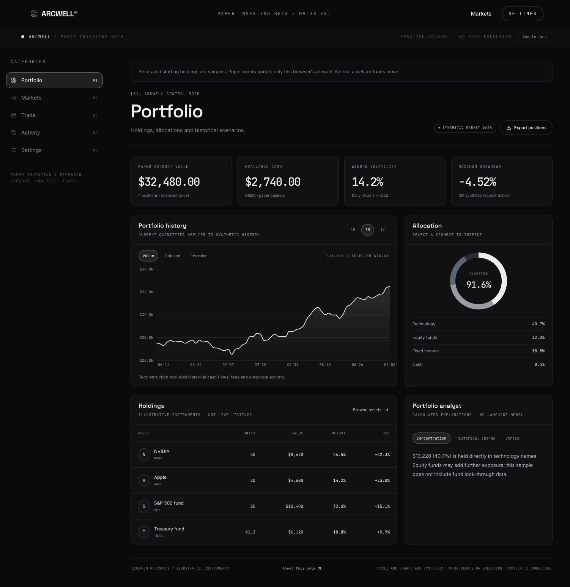
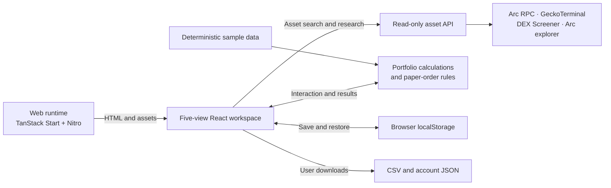

<p align="center">
  
</p>
<h1 align="center">ARCWELL</h1>
<p align="center"><strong>Explore assets. Practice investing. Know your portfolio.</strong></p>
<p align="center">A focused paper-investing workspace with a premium trading interface.</p>

<p align="center">
  <a href="https://www.arcwellfi.com/dashboard"><strong>Open the beta</strong></a> ·
  <a href="#the-mvp-in-five-views">Product tour</a> ·
  <a href="docs/briefs/overview.md">Project overview</a> ·
  <a href="#run-locally">Quick start</a> ·
  <a href="https://x.com/ARCWELLFI">Follow on X</a>
</p>

<p align="center">
  <a href="https://github.com/ArcwellLabs/arcwell-public/actions/workflows/ci.yml"></a>
  
  
  <a href="LICENSE"></a>
</p>

## From an asset idea to a portfolio you understand

ARCWELL makes the core investing journey tangible: find an asset, inspect its
price history, practice a buy or sell, and see what changed in your portfolio.
The MVP puts that journey into **five connected views**, with interactive charts,
clear order review, and a paper account that stays with you in the same browser.

Open it and start exploring. There is no account setup, wallet connection, API key,
or database to configure for the demonstration.

**Markets now connects to live Arc data.** Search by name, symbol, or contract
address and inspect source-linked prices, liquidity, volume, contract metadata,
and available history. Portfolio and Trade remain paper simulations with synthetic
prices and starting holdings. No real assets or money move.

Read the [asset research guide](docs/ASSET-RESEARCH.md) for coverage, sources,
freshness, and unavailable-data behavior.

[](https://www.arcwellfi.com/dashboard)

<p align="center"><sub>The MVP interface: Portfolio, Markets, Trade, Activity, and Settings. All figures shown are sample data.</sub></p>

|       5 connected views       |      16 sample instruments       |        Local paper account         |
| :---------------------------: | :------------------------------: | :--------------------------------: |
| One focused investing journey | Search, filter, compare, inspect | Holdings, cash, fills, and exports |

## The MVP in five views

### 01 · Portfolio — see the whole account

Understand how a paper account is put together. Inspect holdings and available
cash, select an allocation segment, and switch the portfolio chart between value,
indexed comparison, and drawdown. Move directly from a holding into Trade.

Calculated explanations put concentration and historical changes into words.
These explanations come from the account data and formulas, with no language
model involved. Portfolio history applies today's quantities to synthetic prices;
it is a reconstruction, not an actual investment track record.

[Explore Portfolio →](https://www.arcwellfi.com/dashboard?view=portfolio)

### 02 · Markets — discover and compare

Search Arc Mainnet or Testnet by name, symbol, or contract address. Results keep
lookalike tickers separate and identify Arc’s published reference contracts.

Inspect live contract metadata, pool prices, liquidity, volume, holder counts, and
available daily history. DEX Screener, GeckoTerminal, Arc RPC, and explorer
observations carry source links and retrieval times. Missing data stays unavailable.
Mainnet pricing is never applied to testnet assets.

Research is read-only; selecting a real Arc asset does not turn it into an executable
order or silently add it to the separate sample trading universe.

[Explore Markets →](https://www.arcwellfi.com/dashboard?view=markets)

### 03 · Trade — rehearse the decision

Inspect candlesticks, sample volume, a 20-session moving average, and a
14-session simple-window RSI. Choose buy or sell, enter a quantity, and review the
paper order before confirming it. The account updates cash, holdings, and activity
together.

The order rules reject insufficient cash, overselling, invalid quantities, and
unsupported precision. A separate slippage calculator illustrates an assumption;
it does not represent live liquidity or change the fixed-price paper fill.


[Explore Trade →](https://www.arcwellfi.com/dashboard?view=trading)

### 04 · Activity — follow what changed

Review simulated buys and sells, filter the paper activity, inspect its cash
history, and export fills as CSV. Each paper fill links the decision back to its
symbol, quantity, price, and time. This is the history of the local practice account.

[Explore Activity →](https://www.arcwellfi.com/dashboard?view=ledger)

### 05 · Settings — keep control of your data

Export the complete paper account as JSON, read the product's current limits, and
reset to the sample starting account with confirmation. Storage status is visible,
including when the browser cannot save changes.

The account is local to this browser and site. Clearing site data removes it;
another device has a separate account. JSON export provides a copy for inspection;
account import is not part of this MVP.

[Explore Settings →](https://www.arcwellfi.com/dashboard?view=settings)

## Small surface area, thoughtful engineering

The interface stays focused because its five views share the same account model.
A paper fill is a state transition: validation happens first, then cash, positions,
and the activity ledger update together. A persistence hook saves that state and
checks its structure when loading it again.



**The browser runs the investing simulation.** The server renders and delivers
the application and serves cached, rate-limited asset research. There is no
customer-account database, brokerage connection,
wallet signing, deposit flow, or real order execution in the MVP.

| Technology                          | Role in the experience                                                     |
| ----------------------------------- | -------------------------------------------------------------------------- |
| **React 19 + TypeScript**           | Shared account state, reusable views, and typed domain logic               |
| **TanStack Start + Router**         | Server rendering and direct links to the five workspace views              |
| **Recharts + custom SVG charts**    | Portfolio histories, candles, allocation, and market comparisons           |
| **Tailwind CSS + Radix primitives** | A consistent dark interface and structured interactive controls            |
| **Pure calculation functions**      | Inspectable statistics, deterministic fixtures, and paper-order validation |
| **Vite + Nitro + Node.js**          | Production build and container-based application delivery                  |

### Details that make the beta useful

- **A connected account:** practice a trade and inspect the result across Portfolio
  and Activity without rebuilding the scenario.
- **Repeatable data:** seeded sample histories make demonstrations and calculation
  checks reproducible.
- **Explicit order rules:** invalid paper orders fail visibly, before account state
  changes.
- **Portable outputs:** export positions and fills as CSV, or the complete paper
  account as JSON.
- **Visible assumptions:** sample labels and product limits distinguish practice
  from live investing.
- **Reviewable implementation:** source, domain tests, TypeScript checks, and
  publication guards are part of the repository.

Browser storage is editable and is not a secure financial ledger. Automated checks
verify selected behavior; they do not constitute an independent security audit.

## Try the complete workflow

1. Open **Markets**, choose a sector, and inspect a sample asset.
2. In **Trade**, review and confirm a small paper buy.
3. Open **Portfolio** to see the updated holding and allocation.
4. Check **Activity** for the fill, then use **Settings** to export the account.

The beta is designed to make this core loop easy to understand and evaluate.

## Run locally

Use **Node.js 22.18+** and npm. No API keys, database, or paid service are required
for local use.

```sh
git clone https://github.com/ArcwellLabs/arcwell-public.git
cd arcwell-public
npm run setup
npm run identity:setup
npm run dev
```

Open [localhost:5180](http://localhost:5180).

<details>
<summary><strong>Build commands and source map</strong></summary>

```sh
npm run verify          # formatting, tests, TypeScript, production build
npm run identity:check  # contributor identities and complete Git history
npm run privacy:check   # current identity and staged content
npm run preview        # production preview
```

| Source                                                | Responsibility                                   |
| ----------------------------------------------------- | ------------------------------------------------ |
| `frontend/src/pages/Dashboard.tsx`                    | Shared workspace and navigation                  |
| `frontend/src/lib/dashboard-release.ts`               | Public MVP view selection                        |
| `frontend/src/pages/dashboard/InvestingWorkspace.tsx` | Portfolio, Markets, Trade, and Activity          |
| `frontend/src/pages/dashboard/MvpSettings.tsx`        | Account export, reset, and product limits        |
| `frontend/src/lib/quant.ts`                           | Sample prices, statistics, and paper-order rules |
| `frontend/src/hooks/usePaperBook.ts`                  | Validated browser-local account persistence      |
| `frontend/src/server.ts`                              | Server entry and rendering-error handling        |
| `Dockerfile`                                          | Build and Node.js runtime container              |

The README describes the enabled MVP. The release configuration is the authority
for which views belong to the public dashboard.

</details>

## Read and share

| Brief                                          | What it explains                                                        |
| ---------------------------------------------- | ----------------------------------------------------------------------- |
| [Project overview](docs/briefs/overview.md)    | The MVP's purpose, customer value, and evaluation criteria              |
| [Frontend experience](docs/briefs/frontend.md) | The five-view journey and the technology behind the interface           |
| [Backend architecture](docs/briefs/backend.md) | Application delivery, paper-account data flow, and operating boundaries |

## Help shape the core experience

Try the paper-investing loop and tell us where it becomes unclear. Useful
contributions include clearer asset comparisons, accessible chart interactions,
reproducible bug reports, and tests for account boundary conditions.

[Contribution guide](CONTRIBUTING.md) · [Report an issue](https://github.com/ArcwellLabs/arcwell-public/issues) ·
[Security policy](SECURITY.md) · [Publication controls](docs/IDENTITY.md) ·
[Updates on X](https://x.com/ARCWELLFI)

## License

ARCWELL's original code and documentation use the
[PolyForm Noncommercial License 1.0.0](LICENSE), with the required notice in
[NOTICE](NOTICE). Commercial use requires separate permission from the relevant
rights holder.

This is **source-available software**. Third-party packages and incorporated
components retain their own licenses; see [third-party notices](THIRD_PARTY_NOTICES.md).
ARCWELL is independent software; no affiliation or endorsement by Arc or Circle is implied.
