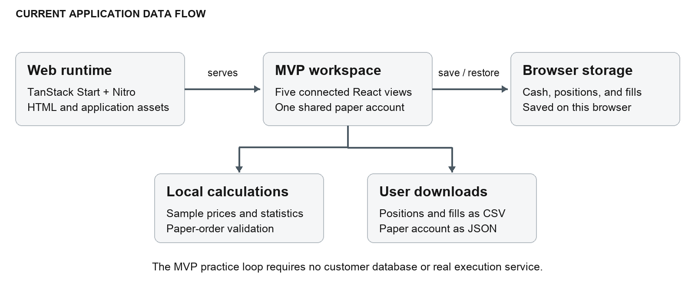

# ARCWELL backend architecture

How the MVP serves the app and handles paper account data

September 2026 · Research prototype

ARCWELL's MVP uses a web runtime to render and deliver the application. Portfolio calculations, paper-order validation, and account updates run in the browser. The result is a working practice experience without a customer database or real execution service.

For customers and investors, the key distinction is where responsibility sits: the server provides the interface, and the browser holds the simulated account. The MVP does not operate an authoritative financial ledger, store customer funds, or submit brokerage orders.

## Application delivery

TanStack Start handles server rendering through the application's server entry. Nitro packages the runtime, and the container serves it with Node.js. The server wrapper converts selected catastrophic rendering failures into a controlled error page. This layer delivers the five-view experience.

## The account lifecycle

On load, a persistence hook reads the saved paper account and checks its structure. If no valid account is available, the app presents the sample starting state. When a user confirms a valid paper order, the account updates cash, positions, and fills together, then persists the new state locally.

CSV exports and the Settings account JSON download are created in the browser. No customer-account API or database is involved in the practice loop. Storage failures are visible rather than silently implying that changes were saved.

## Implemented rules behind the interface

| Rule or mechanism       | Practical effect                                                                                       |
| ----------------------- | ------------------------------------------------------------------------------------------------------ |
| Order validation        | Rejects unknown assets, invalid quantities, unsupported precision, insufficient cash, and overselling. |
| Shared state transition | Updates cash, holdings, and the paper-fill ledger together.                                            |
| Storage validation      | Checks saved account structure before using it and reports unreadable or unavailable storage.          |
| Seeded sample histories | Keeps price fixtures and calculation behavior reproducible.                                            |
| Confirmed reset         | Requires an explicit confirmation before resetting the account from Settings.                          |

## How portfolio numbers are produced

Pure TypeScript functions calculate account value from sample prices and quantities, simple returns, annualized volatility, drawdown, and chart indicators. Paper orders fill at fixed sample prices and use JavaScript numbers with explicit rounding. The simulator does not model an exchange order book, partial fills, corporate actions, or real settlement.

Portfolio history applies today's holdings and cash to synthetic historical prices. This makes comparisons interactive, but the result is a fixed-holdings reconstruction rather than a record of actual investment performance. The code separates these calculations from the chart components so behavior can be inspected and tested.

## Data and operating boundaries

The account lives in localStorage on the current browser and site. It can be edited locally, is not synchronized, and can be lost when site data is cleared. It must not be treated as secure accounting or a backed-up customer system of record. Downloads provide user-controlled copies; account import is not included.

The MVP needs no authenticated account service, external price feed, wallet connection, or payment processor for its sample workflow. This describes the application data flow; it does not imply anonymous web browsing or the absence of ordinary hosting logs. No uptime or disaster-recovery commitment is established by the prototype.

## What a technical evaluator can verify

Inspect the account and order functions, reproduce the build, exercise rejected orders, and confirm that refresh restores a valid paper account. The domain tests cover selected calculation and state boundaries. Automated checks support review, but they are not an independent security audit or production-readiness certification.

[Explore ARCWELL](https://arcwellfi.com) · [Open the source](https://github.com/ArcwellLabs/arcwell-public) · [Follow ARCWELL](https://x.com/ARCWELLFI)

Implementation references: Dockerfile; frontend/src/server.ts; frontend/src/lib/quant.ts; frontend/src/hooks/usePaperBook.ts; frontend/src/pages/dashboard/MvpSettings.tsx; tests/quant.test.ts. Public source is licensed under PolyForm Noncommercial 1.0.0; commercial use requires separate permission.
