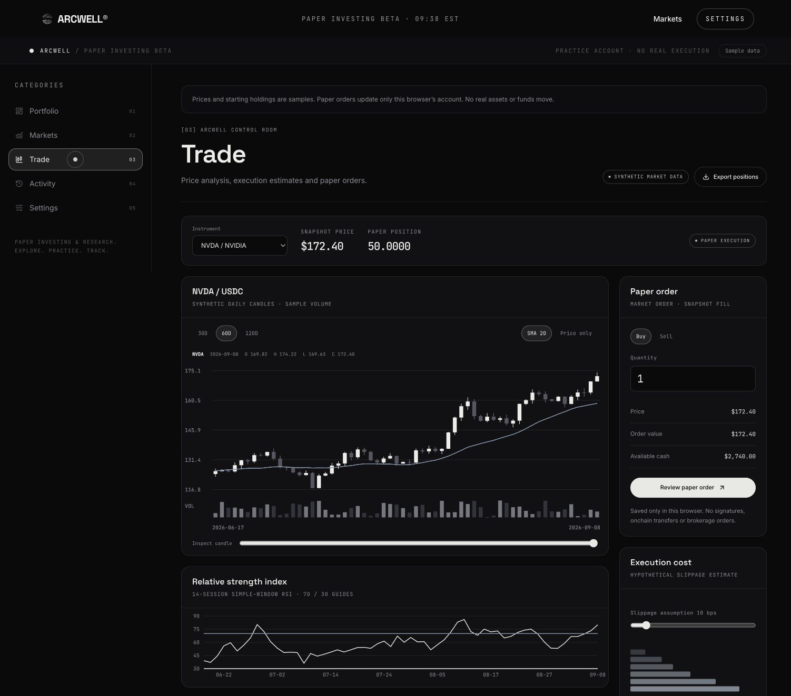

# ARCWELL frontend experience

The five view journey from discovery to paper activity

September 2026 · Research prototype

ARCWELL's frontend makes the investing journey visible. The MVP connects asset discovery, paper-order review, portfolio inspection, and activity tracking through five clearly named views. It gives users a practical way to explore how decisions change an account.

The interface uses a consistent dark palette, structured navigation, and interactive charts. A sample asset selected in Markets opens in Trade. A confirmed paper fill updates the shared account used by Portfolio and Activity, keeping the journey connected.

## Visual detail that serves the workflow

Market heatmaps make the sample universe easy to scan. Candles, volume, a moving average, and a simple-window RSI support price exploration. Allocation segments, chart ranges, and portfolio explanations help users inspect their practice account.

## A walkthrough of the MVP

1. Start in Markets. Search an instrument, select a sector, or sort the sample universe. Compare return, volatility, and drawdown before opening the selected asset in Trade.

1. Practice in Trade. Choose buy or sell, enter a quantity, and review the order before confirming. The app checks cash, available holdings, and quantity precision.

1. Inspect Portfolio and Activity. Review the updated holding and allocation, then inspect the paper fill and cash history. Export positions or activity as CSV.

1. Manage the account in Settings. Export a JSON copy, read storage status and product limits, or confirm a reset to the sample starting account.

## Technology translated into user value

| Frontend choice               | Role in the MVP                                                        |
| ----------------------------- | ---------------------------------------------------------------------- |
| React 19 and TypeScript       | Reusable views with shared account state and typed calculation logic.  |
| TanStack Start and Router     | Server-rendered application pages and direct links to workspace views. |
| Recharts and custom SVG       | Interactive histories, allocation, candles, and market comparisons.    |
| Tailwind and Radix primitives | A consistent visual system and structured interactive controls.        |
| Browser-local persistence     | The same practice account survives refreshes without signup.           |

## Clear expectations at every step

The beta identifies prices and starting holdings as samples. The portfolio analyst uses calculated explanations, not a language model. Historical charts apply current quantities to synthetic histories and exclude historical cash flows, fees, and corporate actions. A slippage illustration is separate from the fixed-price paper-fill calculation.

The saved account belongs to this browser and site. Clearing site data removes it; another device has a separate account. A JSON export is a downloadable copy for inspection, not an account synchronization or import feature. Settings explains these limits alongside the controls.

## What to evaluate in a demonstration

Ask a first-time user to find a sample asset, complete a paper order, and explain its effect on holdings and cash. Review whether the user can locate the fill, export the account, and recognize that no real funds moved. That is the core experience this release is designed to demonstrate.

[Explore ARCWELL](https://arcwellfi.com) · [Open the source](https://github.com/ArcwellLabs/arcwell-public) · [Follow ARCWELL](https://x.com/ARCWELLFI)

Implementation references: frontend/src/pages/dashboard/InvestingWorkspace.tsx; QuantCharts.tsx; MvpSettings.tsx; frontend/src/hooks/usePaperBook.ts; frontend/package.json. The release configuration defines the five enabled MVP views.
